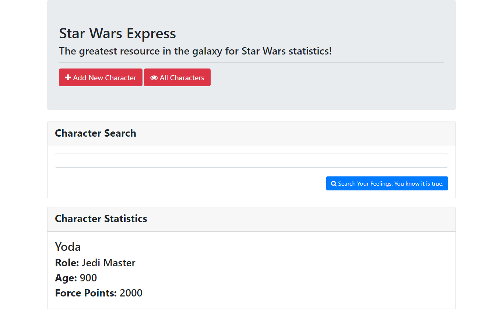

# **Instructions**

* Spend a few moments looking over the code sent to you. First, get the server running, then begin to dissect the JavaScript code found at the bottom of `add.html`.

* Explain to one another what the code does, what its for, and why its relevant to the application so far. Be sure to explain to one another what the `$.post` code is doing.

## Links
[link to GitHub!](https://github.com/ryanwit/final_star_wars_app)

[link to Heroku Page!](https://ancient-woodland-57450.herokuapp.com/)

## Image
